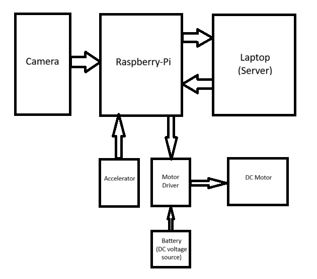

# Introduction
This project was built by me and my friends as part of my college curriculum. It turned out to be a pretty simple project that we could build and demonstrate with ease.
\
The idea is to use a machine-learning-based model to automatically set vehicle speed limits based on traffic signs. Of course, this system might be annoying and impractical to implement in a real vehicle, it does teach you something. 
\
I guess if someone were to actually implement it, it would prevent accidents as well as speeding tickets.

# Architecture
The following diagram shows the general system architecture:



We decided on a client-server approach that uses the Raspberry-Pi as the embedded hardware, and a laptop(better if with a GPU) for the computational power required for inference.


# Hardware
The list of specific hardware components we used is as follows:
- Raspberry-Pi 3B+
- KY-040 rotary encoder (simulates accelerator)
- L298N motor driver
- Battery operated DC motor
- 4 1.5V AA batteries
- Lenovo 300 FHD webcam

# Pipeline
1. The video is captured by the webcam.
2. The video is then streamed via a Flask server. 
3. The server (which is on the same Wi-Fi network) receives the stream and uses a YOLOv11 model to infer the speed from a traffic sign, if present. 
4. The server then sends the inferred speed back to the Raspberry-Pi.
5. The Raspberry-Pi receives the information and if the speed limit detected is different than the current speed limit, sets a new speed limit.

The motor is just for the purpose of a physical demonstration. The speed of the motor is controlled by a mock accelerator, and the motor can take any speed between 0 and the speed limit.

# Code
## Client 
The client runs two processes simultaneously: Capturing and sending the video feed and controlling the motor.
The camera logic uses `opencv` and is present in `camera.py`.
The motor control is present in `main.py` itself. 

## Server
The server has a single process, which receives the video stream, runs the YOLO model for inference, and sends the detected speed back to the client.

# Setup
Clone the repository on both the server and the Raspberry-Pi. 

## Server-side setup
Go to the `server` subdirectory and install the requirements in a Python virtual environment. Then simply run the server.
```bash
cd server
python -m venv venv
source venv/bin/activate     # venv\scripts\activate on windows
pip install -r requirements.txt
python server.py
```
Note that I am using Python 3.12.6 on the server.

## Client-side setup
Go to the `raspberry-pi` subdirectory and install the requirements. Do **NOT** create a virtual environment if you are using GPIO, as the Raspberry-Pi GPIO libraries only work outside a virtual Python environment. If you won't be using GPIO for the connections, a virtual environment is fine. 

Run `main.py` to start the client side. You can either use a hardware input to simulate acceleration or use keyboard input.

```bash
cd raspberry-pi
pip install -r requirements.txt
python main.py
```

Here is the diagram for the connections we made:
// make diagram

# Credits
The model we used was not trained by us. I took it from [this](https://github.com/bhaskrr/traffic-sign-detection-using-yolov11?tab=readme-ov-file) repository. 

